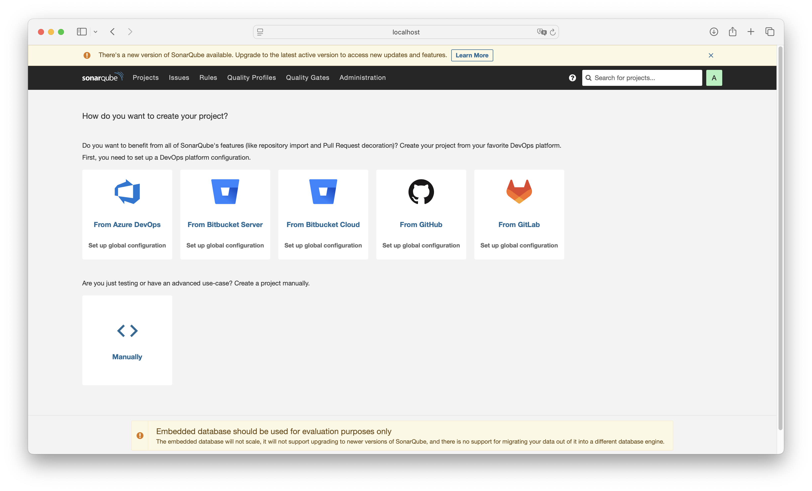
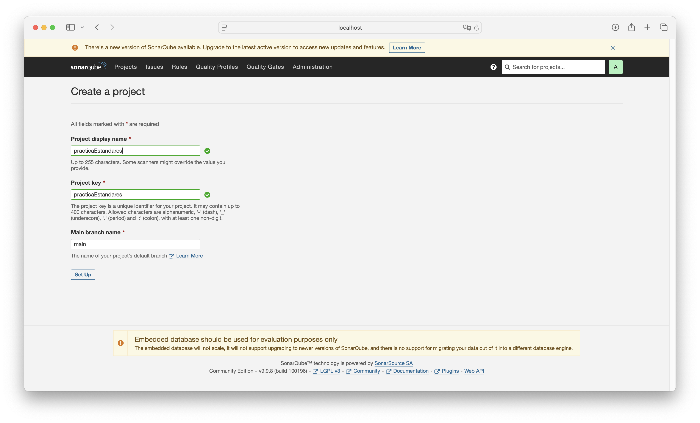
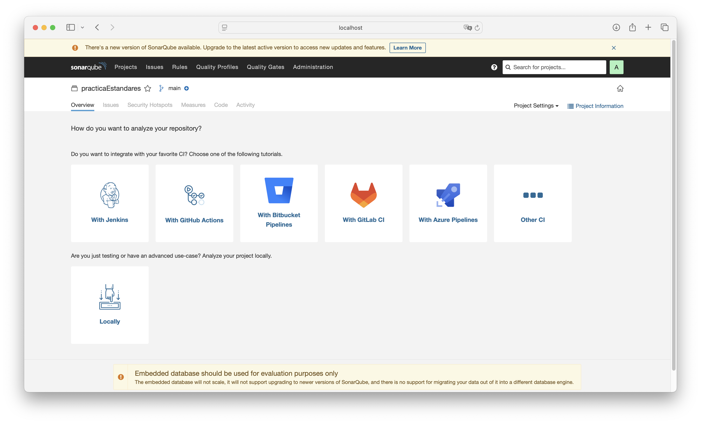
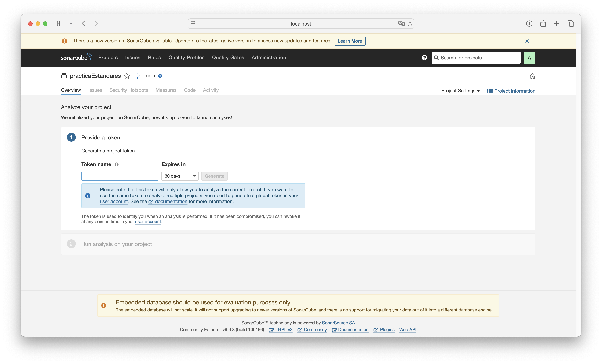
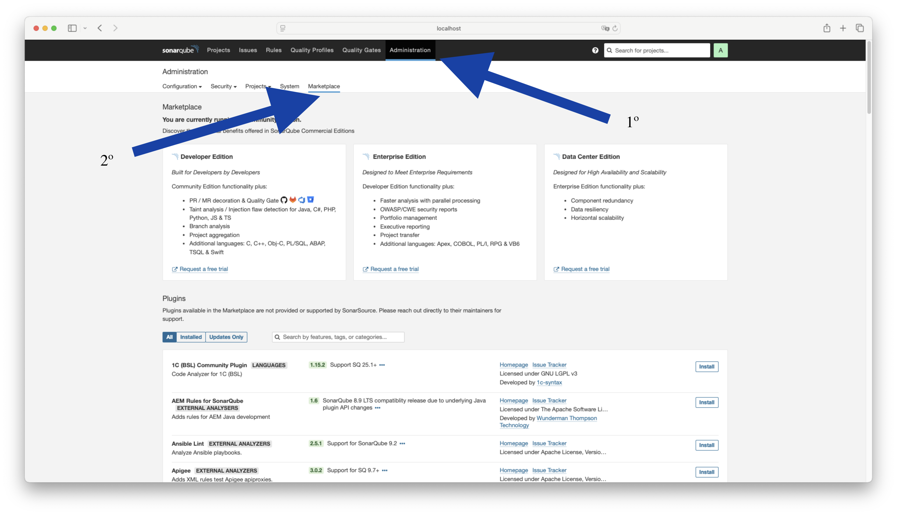
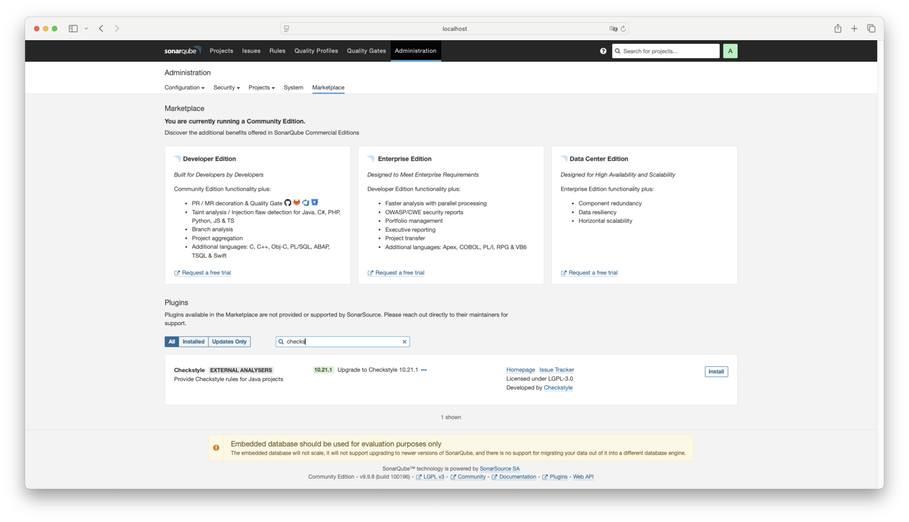
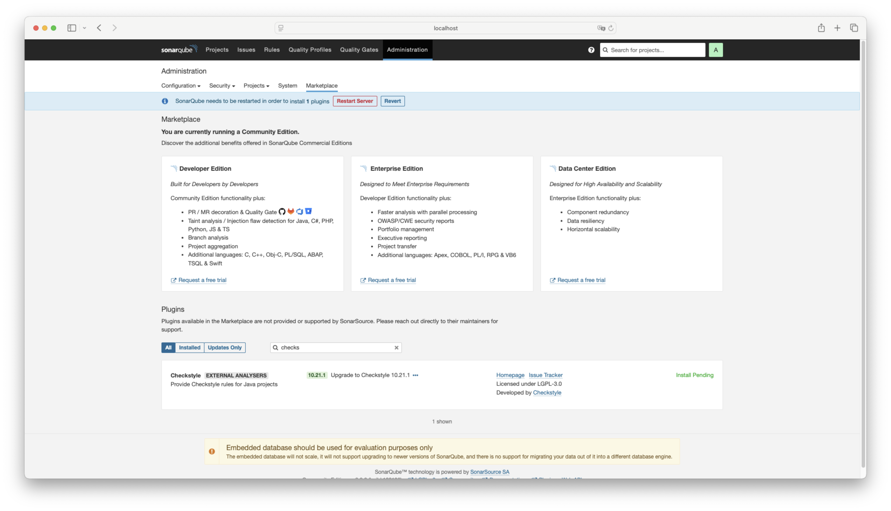
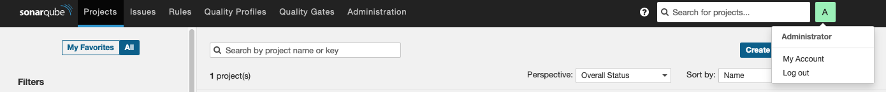
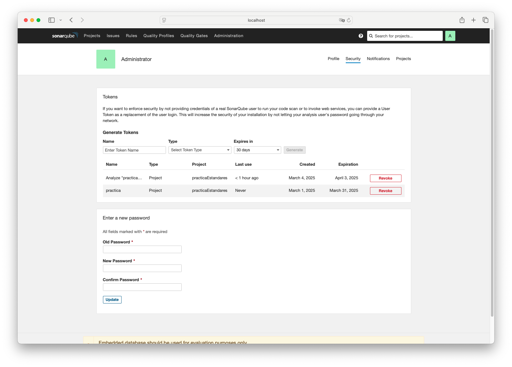

# Práctica

En este documento se explicará el proceso para configurar y utilizar SonarQube con Docker y Maven.

## Guía

### Requisitos previos

Para la realización de esta práctica será necesario tener Docker instalado: [página oficial de Docker](https://www.docker.com).
Para comprobar si ya lo tienes instalado puedes utilizar el comando:
```sh 
 docker -v
```
También será necesario tener java instalado: [página oficial de Java](https://www.java.com/es/).
Para comprobar si ya lo tienes instalado puedes utilizar el comando:
```sh 
java -version
```
Si estás en Windows, es necesario tener Git instalado: [página de git](https://git-scm.com/).

Además, es necesario clonar el repositorio donde se encuentra esta práctica.

Por último será necesario tener instalado maven. Dependiendo del IDE que estés utilizando no será necesario hacer la instalación ya que está integrado, como en el caso de Eclipse. En caso de que utilizar VS Code, puedes instalar una extensión para hacer uso de maven. [Extensión de maven para VS Code](vscode:extension/vscjava.vscode-java-pack). O también puedes instalar maven de forma global en tu dispositivo. [Página oficial de Maven](https://maven.apache.org/download.cgi).

### Realización de la práctica

1º Inicia la aplicación de docker desktop.

2º Para iniciar sonoarqube será necesario estar en la carpeta donde se encuentra el archive docker-compose.yml. Es decir, en la misma ruta que se encuentra este readme.

3º Para levantar SonarQube habrá que ejecutar el siguiente comando:
```sh 
 docker-compose up -d
```
 Si te da error, puede ser porque ya estás usando el puerto 9000 o tienes un container de sonarqube ya instalado. Si quieres mantener tu otro contenedor, cambia "container_name" en el archivo "docker-compose.yml". Si ya estás usando el puerto 9000, cambia el puerto en el atributo "ports" del archivo "docker-compose.yml".

 En la ruta donde se encuentra el archivo "docker-compose.yml" y "pom.xml", utilizaremos el comando:
```sh
mvn clean install -U
````
para asegurarnos de que todas las dependencias estén instaladas correctamente.

4º Ya puedes acceder a sonarqube en http://localhost:9000. Con usuario y contraseña "admin". Esta contraseña la hemos especificado en el archivo docker-compose.yml, en el apartado de "environment". Como es el usuario admin, te pedirá una nueva contraseña que cumpla ciertos requisitos. Por ejemplo: admin123.

5º Una vez entremos en la interfaz web, deberíamos ver una pantalla como la que sigue: 



6º Ahora vamos a crear un proyecto local. Como se observa en la siguiente imagen, se ha puesto un nombre de ejemplo, pero puedes poner el más acorde según el proyecto que vayas a realizar. Y después elegiremos utilizar una configuración global.


7º Una vez llegados a este punto, ya tienes creado un proyecto base de SonarQube. Ahora, procederemos a analizar el repositorio de forma local. Si tienes dudas sobra su localización, puedes ver la siguiente imagen.


Después, crearemos un token secreto y personal. Le podemos dar el nombre que nos parezca más oportuno y que sea funcional durante un tiempo determinado.


Una vez lo creemos, es muy importante guardar este token ya que no volverá a mostrarse. Después, procederemos a analizar el código mediante maven. Si pulsamos el botón de Maven, nos devolverá el comando a usar para analizar nuestro proyecto con el token que acabamos de generar y el nombre del proyecto sonarqube.

El comando es el que sigue:
```sh 
mvn clean verify sonar:sonar \
  -Dsonar.projectKey=practicaEstandares \
  -Dsonar.host.url=http://localhost:9000 \
  -Dsonar.login=token
````

donde token, será el autentificador que hemos recibido antes. En caso de haberlo perdido,  [haz clic aquí](#qué-hago-si-he-perdido-mi-token-de-sonarqube). ProjectKey puede cambiar según lo especificado anteriormente en el paso seis. La url también puede ser distinta si cambiaste el puerto al principio de esta práctica. Es importante primero hacer un análisis para realizar la configuración inicial del proyecto. 

Además, le añadiremos el comando un parámetro de configuración para indicar donde se guardan los resultados del análisis de Checkstyle.
```sh 
mvn clean verify sonar:sonar \
  -Dsonar.projectKey=practicaEstandares \
  -Dsonar.host.url=http://localhost:9000 \
  -Dsonar.login=token
  -Dsonar.java.checkstyle.reportPaths=target/checkstyle-result.xml
```

Ahora, instalaremos el plugin de Checkstyles en SonarQube, para ello, nos dirijiremos a Administration y después de Marketplace.


Después, en el apartado de plugins buscaramos "Checkstyle". Esta es una herramienta de análisis estático para código Java que ayuda a mantener un estilo de codificación uniforme y detectar posibles errores de estilo o malas prácticas.


Por último, descargaremos el plugin de Checkstyle y reiniciaremos el servidor. El propio servicio de SonarQube nos lanzará una advertencia para que reiniciamos el servidor y así poder instalar el plugin fácilmente.



El código debe ejecutarse en la ruta donde se encuentre el archivo pom.xml. Esto es opcional, pero por comodidad, se puede crear un script shell para ejecutarlo más rápidamente y de forma más limpia. Para ello, utilizaremos el siguiente comando (recuerda poner tu token en el apartado de login):
```sh 
echo "mvn clean verify sonar:sonar \
  -Dsonar.projectKey=practicaEstandares \
  -Dsonar.host.url=http://localhost:9000 \
  -Dsonar.login=token \
  -Dsonar.java.checkstyle.reportPaths=target/checkstyle-result.xml \
  -U" > Run.sh
```
En caso de que tengas UTF-16 a la hora de crear el archivo puede dar problemas, por lo que se recomienda usar UTF-8.
Si nuestro sistema operativo es Linux o Mac y utilizamos el comando
```sh
ls -l Run.sh
```
nos daremos cuenta de que ahora mismo el script no tiene permisos de ejecución, saldrá algo como esto: "-rw-r--r--@ 1 usuario  grupo". Para añadir permisos de ejecución, necesario para ejecutar directamente el script desde la terminal, escribiremos en la consola el siguiente comando:
```sh
chmod +x Run.sh
```
Si ocurre algún error, podría ser por el fallo de alguna dependencia entre el espacio temporal que se preparó la práctica y se hizo, por lo que se recomienda usar el siguiente comando:
```sh
mvn clean install -U
````
Si hay dependencias desactualizados en target, el comando clean elimina esos archivos, y la opción -U fuerza a Maven a actualizar esas dependencias, descargando nuevas versiones o corrigiendo cualquier inconsistencia.

## ¿Qué hago si he perdido mi token de SonarQube?

Si has perdido el token de SonarQube, primero dirigete a tu perfil. Para ello, pulsa en la letra que se encuentra en la esquina superior derecha de la página. Y pulsa "My Account".


Después, nos dirigiremos al apartado "Security" y en el apartado de "Generate Tokens", generaremos un nuevo token. En caso de que generes uno de tipo "Project Analysis Token", recuerda elegir en "Proyect" el nombre del proyecto que elegiste al empezar la práctica. 

